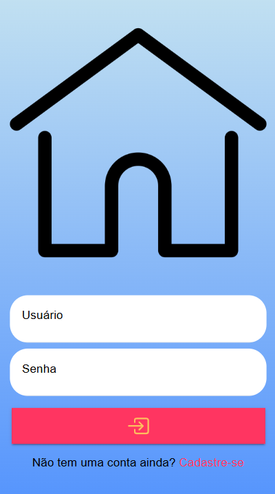
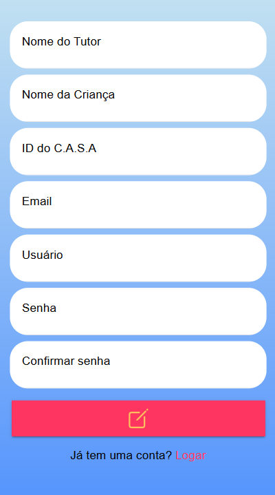
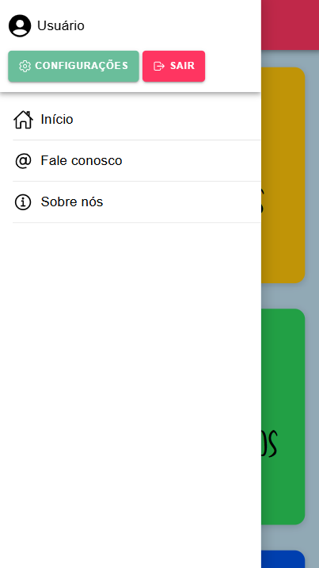
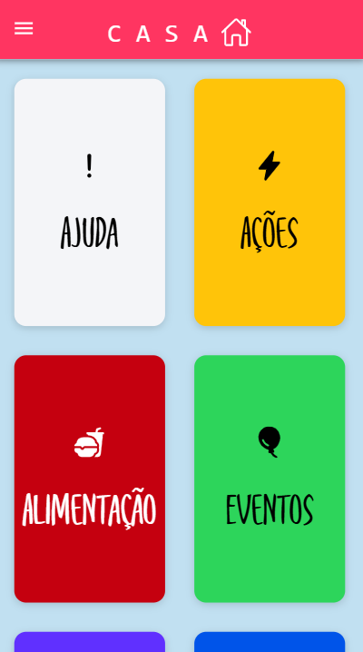
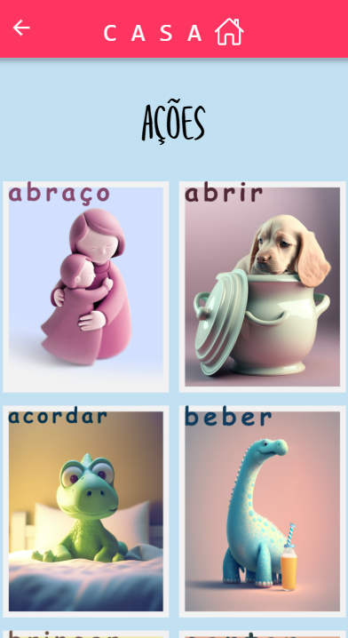
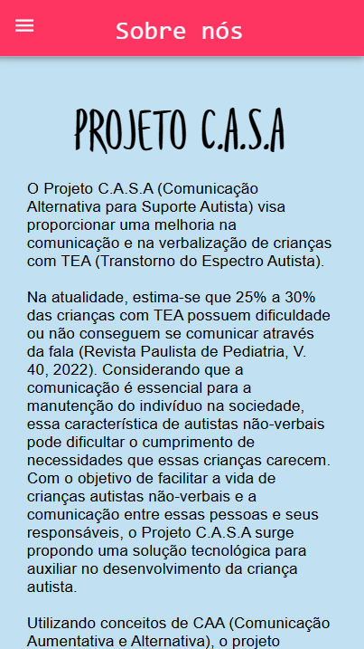
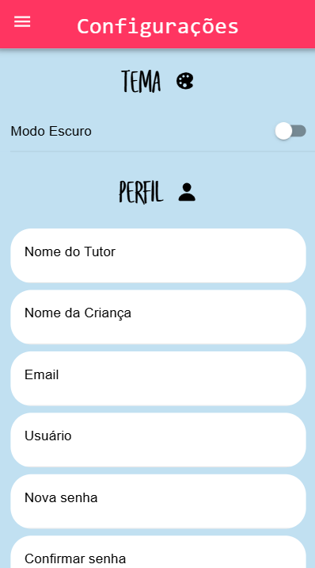
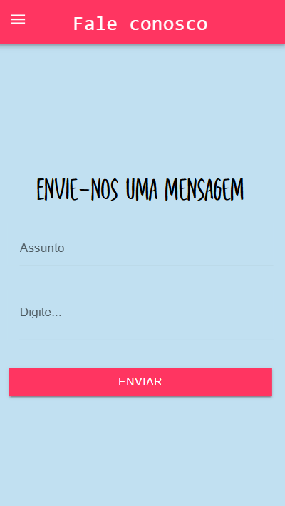
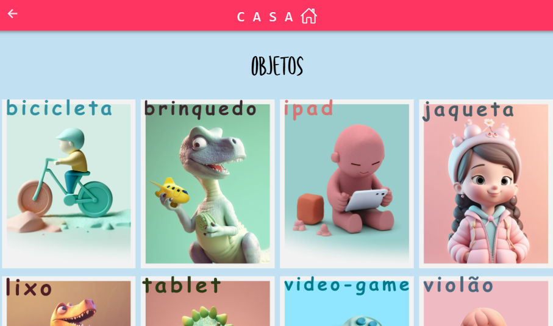
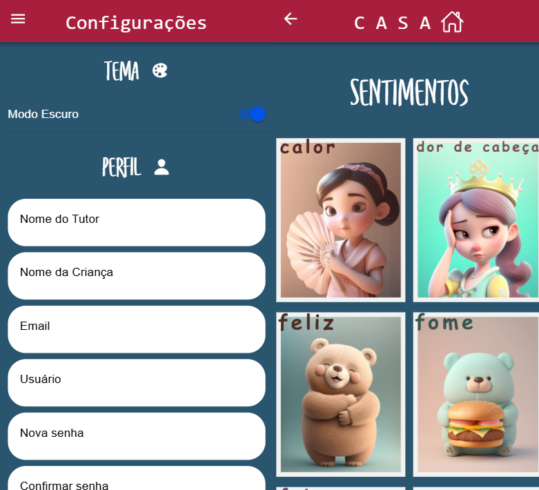

# CASA
## Aplicativo para auxílio na comunicação de crianças autistas não verbais através da PECS

&nbsp;

### SOBRE O PROJETO
O aplicativo **CASA** (Comunicação Acessível para Suporte Autista) foi desenvolvido para auxiliar crianças autistas não verbais a se comunicarem por meio do método PECS (Picture Exchange Communication System). A PECS foi inventada em 1985 pelo pesquisador Andy Bondy e é uma abordagem baseada em troca de figuras que permite que crianças com Transtorno do Espectro Autista (TEA) expressem suas vontades, necessidades e sentimentos através de imagens e símbolos.

O principal objetivo do aplicativo é fornecer uma plataforma digital acessível e interativa, que permita às crianças e seus cuidadores utilizarem cartões PECS de forma dinâmica e intuitiva.

&nbsp;

### PROTÓTIPO
Atualmente, o aplicativo está em fase de **protótipo**. O objetivo final é desenvolver um sistema completo com um **CRUD funcional** para gerenciar cartões e áudios personalizados. Além disso, o projeto visa integrar um **módulo de som utilizando Arduino**, permitindo que as crianças escutem os comandos associados às imagens escolhidas.

&nbsp;

### PROCESSO DE DESENVOLVIMENTO
Durante o desenvolvimento do aplicativo, foram trabalhados os seguintes aspectos:
- **Criação da API** para gerenciar imagens e áudios. O código da API você encontra [aqui](https://github.com/filhodepeterpan/api-pecs). Se preferir, acesse diretamente a [API pública](https://api-pecs.vercel.app/cards.json);
- **Bancos de áudios e imagens** para armazenar os cartões PECS no Cloudinary;
- **Design e desenvolvimento da interface** do aplicativo para proporcionar uma experiência acessível e intuitiva;
- O projeto utiliza imagens geradas pela IA do [Jornada do Autismo](https://ajornadadoautismo.com.br/), uma iniciativa do AMA para gerar cartões de PECS. Por conta da descontinuação da ferramenta, há um número limitado de 77 cards selecionáveis no aplicativo.

&nbsp;

### TELAS E TUTORIAL
O aplicativo conta com diversas telas que facilitam o uso da comunicação alternativa. Abaixo estão algumas capturas de tela demonstrando as principais funcionalidades do app, incluindo o **modo escuro**.

#### 1. **LOGIN**

Tela inicial do app
**Importante:** O **login** e a **edição de perfil** são apenas demonstrativos, com **dados fictícios**. Para testes, utilize:
- **Login:** teste
- **Senha:** teste
&nbsp;

Uma vez logado, o usuário só será deslogado se pressionar o botão **SAIR** no menu (VIDE **ITEM 3**).

 

#### 2. **CADASTRO**

O cadastro é apenas **demonstrativo** para tornar o APP visualmente mais completo. No momento há apenas a opção de login (VIDE **ITEM 1**).

 

#### 3. **MENU**

  

No menu, é possível navegar entre diferentes sessões do aplicativo. Abaixo da visualização do usuário, o botão **SAIR** desloga o usuário, enquanto o botão **CONFIGURAÇÕES** redireciona para página de configuurações (VIDE **ITEM 7**)

 

#### 4. **CATEGORIAS**

A página de Categorias apresenta diversas seções que separam os cards tematicamente. Ao clicar em uma delas você será redirecionado para os cards correspondentes àquela categoria.

 

#### 5. **EXEMPLO DE CATEOGRIA: AÇÕES**

Na página da categoria selecionada, você terá acesso aos respectivos cards. **Ao clicar em um card, um som será tocado** de acordo com o nome do card escolhido. Assim, o usuário poderá expressar palavras sem a necessidade uma verbalização tradicional.
- **OBS:** Originalmente, a ideia é que este som saia através de um **dispositivo arduíno** que poderá ser usado pela criança.

 

#### 6. **PÁGINA "SOBRE NÓS"**

Aqui estão algumas informações sobre o Projeto e as tecnologias usadas (página ainda em construção).

 

#### 7. **CONFIGURAÇÕES**

A página de configurações conta com 2 sessões: Tema e Perfil
- **Tema:** o usuário pode escolher alternar para o "Modo Escuro" (VIDE **ITEM 10**);
- **Perfil:** representação visual de um CRUD para enriquecer visualmente a página, uma vez que ainda não há uma integração com um banco de dados.

 

#### 8. **PÁGINA "FALE CONOSCO"**

Aqui foi integrado a API do **EmailJS**. O usuário tem a opção de escolher um assunto e digitar um texto para enviar diretamente para o email do projeto, facilitando a coleta de feedbacks por meio dos **beta testers**.

 

#### 9. **RESPONSIVIDADE**

Pensando em tornar o APP utilizável e responsivo também para **tablets** e celulares no **modo horizontal**, tivemos o cuidado de aplicar uma condicional que verifica a orientação utilizada pelo dispositivo e redistribui os cards de forma a evitar tamanhos desproporcionais e/ou muitos espaços vazios.

 

#### 10. **MODO ESCURO**

Demonstração do APP no modo escuro (VIDE **ITEM 7**). 
- O aplicativo salva essa configuração no local storage, mantendo a configuração escolhida pelo usuário mesmo após o fechamento do CASA.

 

&nbsp;

### COMO FAZER O DOWNLOAD
O aplicativo está disponível para **Android** e pode ser baixado no seguinte diretório:

📂 [Download do APK](./downloads/app/CASA.apk)

Por se tratar de um APK externo, é possível que o sistema operacional exiba um aviso de segurança. O aplicativo **não representa risco ao dispositivo**, mas, caso o usuário prefira, pode realizar uma verificação com um **antivírus** antes da instalação.

&nbsp;

### FEEDBACKS
Seu feedback é essencial para melhorarmos o aplicativo! Caso tenha sugestões, dúvidas ou queira relatar algum problema, entre em contato conosco pelo e-mail **casaapp.contato@gmail.com** ou utilize a aba **Fale Conosco** (VIDE **ITEM 8**) dentro do aplicativo.

Agradecemos pelo seu apoio! 💙